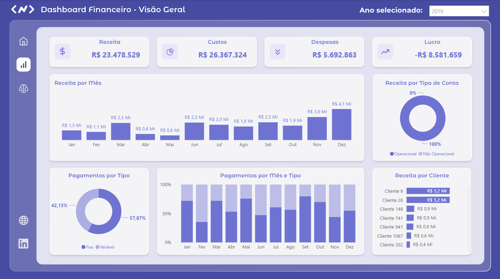
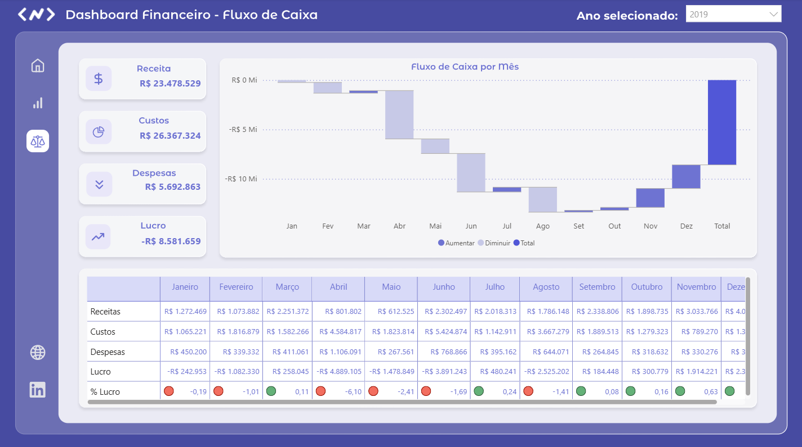

# Dashboard Financeiro – Visão Geral

# 📌 Contexto
Este projeto foi desenvolvido para fornecer uma visão geral financeira, permitindo o acompanhamento de receitas, custos, despesas e lucro, com o objetivo de apoiar a tomada de decisão gerencial.

# 🗃️ Dados
- Dados financeiros simulados
- Principais campos: data, tipo de movimentação, valor, tipo de pagamento, tipo de conta, cliente e categoria

# 🔧 Tratamento e Modelagem dos Dados
- Limpeza e padronização dos dados
- Criação de medidas financeiras
- Cálculo do lucro:
  
  Lucro = Receita - Custos - Despesas

# 📊 Dashboard
O dashboard contempla:
- KPIs financeiros (Receita, Custos, Despesas e Lucro)
- Receita por mês
- Pagamentos por tipo
- Pagamentos por mês e por tipo
- Receita por tipo de conta
- Receita por cliente

# 📊 Dashboard - Telas

### Tela inicial

### Visão Geral

### Detalhamento

Os prints do dashboard estão disponíveis na pasta `/prints`.

# 🎯 Insights
- Identificação de tendências mensais de receita
- Análise da distribuição dos métodos de pagamento
- Visibilidade sobre os clientes e tipos de conta mais rentáveis

## 🛠️ Ferramentas
- Power BI
